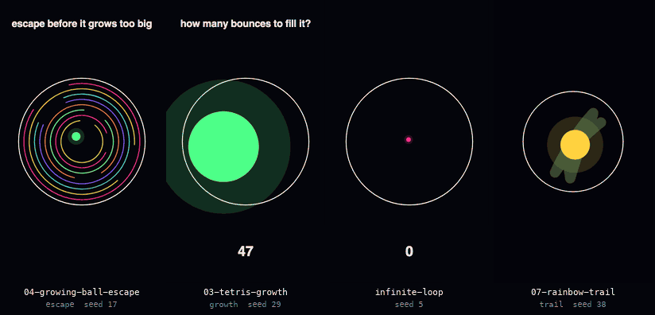
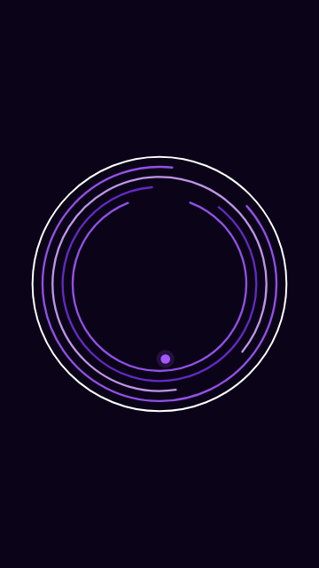
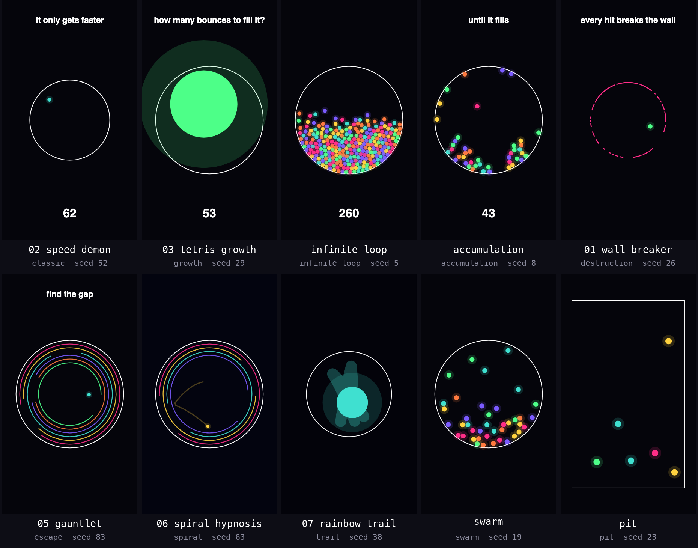

# ball-simulator



Four real renders from `npm run make`, six seconds each, at a third of the real size and 15 fps. From the left: `04-growing-ball-escape` (escape, seed 17), `03-tetris-growth` (growth, seed 29), `infinite-loop` (infinite-loop, seed 5), `07-rainbow-trail` (trail, seed 38). The GIF is silent; [`docs/demo-with-sound.mp4`](docs/demo-with-sound.mp4) is a 6 second clip with the notes.

Describe a bouncing-ball physics video in plain language. A coding agent turns it into a small JSON scene, a deterministic simulation plays the scene, and Remotion renders a vertical 1080x1920 MP4 with one melody note on every bounce.

```text
you:     "ball escaping rotating rings, dark purple, no music, 15s"
agent:   writes scenes/purple-escape.json, runs npm run validate, then npm run make
result:  out/purple-escape.mp4   1080x1920, 60 fps, 15 s, 4.1 MB
```

The engine takes no natural language. The agent is the only interpreter, [AGENTS.md](AGENTS.md) is the contract it works under, and `validate` checks what it wrote before anything renders. Nothing in this repository calls a model or needs a key: a scene is plain JSON you can write yourself.

## Quickstart

Needs Node 22 or newer (tested on 22.22 and 24.5).

```bash
git clone https://github.com/matuskalis/ball-simulator.git
cd ball-simulator
npm ci
npm run make -- scenes/readme-demo.json
```

That writes `out/readme-demo.mp4`: 6 seconds, 1080x1920, 60 fps, H.264 and AAC, 2.9 MB. The first render also downloads Chrome Headless Shell (93.5 MB) once. On the heavily loaded laptop this was written on, the first render took 66 s and 144 s in two fresh checkouts, and later renders of the same clip 16 to 22 s.

```bash
npm run modes                                      # presets, melodies, instruments, the default scene
npm run validate -- scenes/escape-rings.json       # bounce and note counts in about a second
npm run make -- scenes/escape-rings.json --scale=0.25 --frames=0-299 --out=out/preview.mp4   # first 5 s, quarter size
npm run dev                                        # Remotion Studio, live preview
```

`make` hands every flag it does not use to `remotion render`, so `--scale`, `--frames` and `--concurrency` all work.

## What the agent does

[AGENTS.md](AGENTS.md) tells the agent to pick the nearest of ten presets, override only what the user mentioned, write `scenes/<slug>.json`, run `validate` and fix what it says, then run `make`. It never edits `src/` to satisfy a video request. The file also holds the vocabulary that maps what people say onto fields ("8-bit" is `music.instrument: "square"`), the field list, and worked examples.

A scene is a preset plus overrides: 44 fields, all optional except `preset`.

| Group | Fields |
| --- | --- |
| top level | name, preset, seed, fps, width, height, durationSeconds, ballCount, launchSpeed |
| `arena` | kind (circle, rings, box), radius, segments, boxWidth, boxHeight, ringCount, ringSpacing, ringGapDegrees, ringSpeed, ringAlternate |
| `physics` | gravity, restitution, ballRadius, maxSpeed, ballCollisions |
| `effects` | growOnBounce, growToFillAtEnd, speedUpOnBounce, spawnOnBounce, stickOnBounce, breakWalls, trailLength, colorCycle, maxBalls |
| `music` | enabled, melody, instrument, volume, noteSeconds |
| `style` | background, palette, wallColor, glow, showCounter, title |

`validate` rejects what the engine would silently ignore: `"phyiscs"` is reported as `unknown field "phyiscs", did you mean "physics"?`, a string where a number belongs is named, and so is an instrument that does not exist.

### One prompt, start to finish

The prompt is "ball escaping rotating rings, dark purple, no music, 15s". The JSON below is what the contract prescribes for it, written out by hand here; every output is the real thing.

```json
{
  "name": "purple-escape",
  "preset": "escape",
  "seed": 9,
  "durationSeconds": 15,
  "music": { "enabled": false },
  "style": { "background": "#0b0418", "palette": ["#a259ff", "#d4a5ff", "#6b2fd6"] }
}
```

Saved to a file, `validate` says:

```text
VALID
  preset        escape
  duration      15s @ 60fps (900 frames, 1080x1920)
  arena         rings radius 430
  bounces       35 total, 35 audible notes
  balls         1 at start, 1 at the end
  rings         5/10 destroyed, last one at 14.7s
  NOTE: the ball never cleared every ring. Widen arena.ringGapDegrees, lower arena.ringCount, or extend durationSeconds.
```

Half the rings are still standing when the video ends, so the agent lowers `arena.ringCount` to 6 and validates again. That version is `scenes/purple-escape.json`:

```text
  bounces       24 total, 24 audible notes
  rings         6/6 destroyed, last one at 12.1s
```

`npm run make -- scenes/purple-escape.json` simulates, then renders `out/purple-escape.mp4` (4.1 MB). This is its frame 420, 7.0 s in, rendered at 360x640:



## The ten presets



`classic` one ball, endless bounce. `growth` ball grows per hit. `infinite-loop` every bounce clones the ball. `accumulation` balls freeze on landing and pile up. `destruction` each hit destroys a wall segment. `escape` rotating rings with gaps, ball escapes ring by ring. `spiral` tight slow rings, corkscrew outward. `trail` long glowing streak. `swarm` a crowd of colliding balls. `pit` rectangular arena.

The sheet shows one frame of one scene per preset, 360x640, captions read from the scene files. There are 35 scene files: 12 in `scenes/` and 23 in `scenes/viral/` (seven numbered scenes, most with variants).

## How it works

```text
 scenes/x.json
      |  resolveScene (defaults, preset, file) and validateScene
      v
   make ---------------------------------+
      |                                  |
      v                                  v
 Node: simulate(scene)              Chromium: simulate(scene) again
 bounce times -> notes -> WAV       frame n -> SVG -> image
      |                                  |
      +----------------+-----------------+
                       v
            ffmpeg inside Remotion  ->  out/x.mp4
```

- **Physics.** A fixed step of 1/240 s (4 substeps per frame at 60 fps), semi-implicit Euler, gravity 2600 px/s2, balls launched at 900 px/s in a seeded random direction. A wall puts the ball flush against itself, reflects its velocity and scales it by `restitution` (1 by default). Balls collide with equal masses and a frozen ball acts as a wall.
- **Which bounces sound.** A contact slower than 55 px/s is reflected with no note and no effect, which is what stops a settled ball from machine-gunning the melody.
- **Audio.** The n-th audible bounce plays the n-th note of the melody, looping. Pitch is `440 * 2^((note - 69) / 12)`. Five instruments are formulas (sine, square, bell, pluck, piano), each note lasts 0.55 s, and the mix goes through `tanh` into a 44.1 kHz 16-bit WAV. Notes under 45 ms apart merge, so 53,036 bounces in `scenes/infinite-loop.json` become 374 notes.
- **The picture.** One SVG per frame, drawn from the same simulation.

[docs/engine.md](docs/engine.md) has every constant, the collision math, the instrument formulas and the frame timing.

## Determinism

Same seed and scene, same video. Measured, on one machine (M1 Pro, macOS 27, Node 22 and 24, Chrome Headless Shell 149):

| Check | Result |
| --- | --- |
| The same scene rendered three times at 1080x1920 (Node 24 with 5 and with 2 workers, Node 22) | MP4 and WAV byte-identical |
| 60 PNG frames, a range render against a full render, 2 against 5 workers | 60 of 60 byte-identical |
| Simulation hash, Node 22 against Node 24, 35 scenes | identical |
| Simulation hash, Node against the Chromium that draws the frames, 35 scenes | identical |
| Audio decoded from the MP4 against the WAV | not identical: AAC is lossy and 42.7 ms late, the same 42.7 ms throughout |

The last two rows have a history. Node and Chrome disagree by one bit on about 3 percent of `Math.cos` and `Math.sin` inputs, and two of the 34 scenes then in the repository (`swarm`, `infinite-loop`) drew a picture whose bounces no longer matched the notes after a second or two. `src/sim/trig.ts` now does the two calls in exact integer arithmetic, `npm run parity` keeps the two engines honest, and `test/fixtures/golden.json` pins every scene's output. [docs/determinism.md](docs/determinism.md) has the numbers, the commands and what is not claimed.

## Design decisions

**The agent is the parser, the engine is not.** Everything a user can ask for is a config change, so the engine stays small and testable and the contract fits in one file. The cost is that a video is only as good as the agent's choices. `validate` catches typos, wrong types and an unfinished escape, but it cannot tell a dull scene from a good one; a quarter-size preview can, which is why `make` passes `--scale` and `--frames` through.

**Simulate twice instead of storing frames.** Node simulates to get the note times, and each Chromium tab simulates again to draw, so the Studio preview and the render agree without a frame cache and every render worker is independent. The cost is that the two runs must agree to the last bit (they did not, see above) and that the work repeats: `scenes/infinite-loop.json` took between 1.7 s and 15 s to simulate here, depending on how busy the laptop was, once in Node and once per render worker.

**Notes are synthesised, not sampled.** An instrument is a formula, so the WAV is a pure function of the bounce times and nothing needs to be shipped. The cost is five plain timbres.

## Status and limits

- Checked here: macOS on Apple silicon, Node 22 and 24, Remotion 4.0.503. CI runs typecheck and tests on Ubuntu with Node 22 and 24, plus a short render and the parity check.
- The natural-language step is not tested: no model is called by any test or demo in this repository. The scene files in `scenes/` and the walk-through above were written by hand.
- The audio in an MP4 sounds 43 to 59 ms after the contact appears: 42.7 ms of AAC delay added by Remotion's encoder, plus up to one frame because frame n shows the state at time (n + 1) / 60. It is constant, not drift, and this repository does not correct it.
- Only wall contacts and sticking balls make notes. Ball-to-ball hits are silent.
- `restitution` below 1 slows the whole velocity at a wall, the sliding part included.
- Ball collisions compare every pair, so cost grows with the square of the ball count. 260 balls is comfortable; thousands would not be.
- A scene plays at most 3000 notes, and `validate` flags scenes over 180 s.
- Heavy scenes make big files: the 18 s, 260-ball `infinite-loop` renders to 22 MB.

## Tests and CI

```bash
npm run typecheck    # tsc --noEmit
npm test             # vitest: 270 tests in 12 files, 10 to 25 s
npm run parity       # Node against headless Chromium on every scene, about a minute
npm run golden       # rewrite test/fixtures/golden.json after an intended physics or audio change
```

The tests cover the physics step against the closed form of the integrator, wall bounces and note times, restitution and the resting threshold, every effect, ring destruction, ball-to-ball collisions, the seeded generator, exact cos and sin against `bc`, note assignment, pitch, the WAV header, the MIDI reader, scene resolution and validation, the CLIs, every JSON example in these docs, and the golden output of all 35 scenes. Eleven deliberate mutations of the physics (substep count, thresholds, restitution, impulse, ring direction and others) each fail at least one test.

`.github/workflows/ci.yml` runs on every push to `main` and every pull request: typecheck and tests on Node 22 and 24, and a job that renders one second of `scenes/readme-demo.json` at quarter size and runs `npm run parity`.

## Layout

```text
AGENTS.md        the agent contract (CLAUDE.md, .cursorrules and .claude/skills point here)
scenes/          35 scene files
src/scene/       types and defaults, presets, resolve and validate, growth solver
src/sim/         simulate, collide, trig, rng
src/audio/       melodies, MIDI reader, synth and WAV
src/render/      the Remotion composition
src/cli/         make, validate, modes
test/            vitest suites, fixtures, helpers
scripts/         parity and trig probe (need Chromium), golden update, README media
docs/            engine notes, determinism notes, and the pictures above
```

The pictures and the sound clip come from real renders: `npm run docs:assets` regenerates them with `make` and ffmpeg (a few minutes, `scripts/readme-assets.mjs`).
