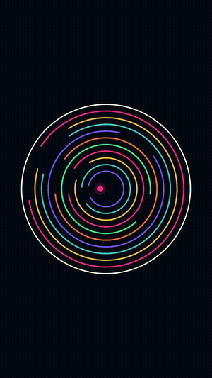

# ball-simulator



*`scenes/readme-demo.json` rendered with `npm run make`, downscaled to a GIF. The real output is 1080x1920 60fps with a note per bounce.*

Prompt-driven bouncing-ball video generator. Same output category as ballsimulator.com — vertical physics clips for Shorts / Reels / TikTok, one melody note per bounce — except the interface is a coding agent instead of a web UI. You say what you want, your local agent writes the scene config and renders the MP4.

```
you: "ball bouncing in a circle that grows every hit, tetris music, 8-bit, 30 seconds"
agent: writes scenes/growing-ball-tetris.json, validates, renders out/growing-ball-tetris.mp4
```

## Setup

```bash
npm install
```

Needs Node 18+. Remotion pulls its own Chromium on first render.

## Use it with an agent

Open the repo in Claude Code, Cursor, or any agent that reads `AGENTS.md`, and describe the video. The agent contract lives in [AGENTS.md](AGENTS.md): prompt vocabulary, presets, full field reference, worked examples, and the rule that a video request is always a config change and never a `src/` edit.

## Use it by hand

```bash
npm run modes                                   # presets, melodies, instruments, default scene
npm run validate -- scenes/escape-rings.json    # bounce/note counts, catches unrenderable scenes
npm run make -- scenes/escape-rings.json        # -> out/escape-rings.mp4
npm run dev                                     # Remotion studio, live preview
```

A scene file is a preset plus the fields you want to override:

```json
{
  "name": "purple-escape",
  "preset": "escape",
  "seed": 9,
  "durationSeconds": 15,
  "music": { "melody": "canon-in-d", "instrument": "bell" },
  "style": { "background": "#0b0418", "palette": ["#a259ff", "#d4a5ff", "#6b2fd6"] }
}
```

## Presets

`classic` one ball, endless bounce. `growth` ball grows per hit. `infinite-loop` every bounce clones the ball. `accumulation` balls freeze on landing and pile up. `destruction` each hit destroys a wall segment. `escape` rotating rings with gaps, ball escapes ring by ring. `spiral` tight slow rings, corkscrew outward. `trail` long glowing streak. `swarm` a crowd of colliding balls. `pit` rectangular arena.

## How it works

- `src/sim/simulate.ts` — deterministic fixed-timestep physics, 4 substeps per frame, seeded PRNG. Same seed and scene always give the same video, which is what keeps audio and video in sync.
- `src/audio/synth.ts` — the CLI runs the simulation first, gets the exact bounce timestamps, and synthesises a WAV where note *n* of the melody lands on bounce *n*. No beat detection, no drift.
- `src/render/BallScene.tsx` — Remotion composition. It re-runs the same simulation from the scene props and draws frame *n*, so the studio preview and the render agree.

Contacts slower than 55 px/s are treated as resting jitter: the ball still bounces off, but no note and no effect fires. That is what stops a settled ball from machine-gunning the melody.

## Render speed

A 6s 1080x1920 60fps clip renders in about 7 seconds on an M-series laptop, so a 20s video is well under a minute. A 260-ball scene is roughly 1.5x that.

## Audio and licensing

Built-in melodies are public-domain (Für Elise, Ode to Joy, Korobeiniki, Canon in D, and similar) or plain scales. You can also pass an array of MIDI note numbers or a path to your own `.mid` file. Do not ship copyrighted melodies transcribed as note arrays.
